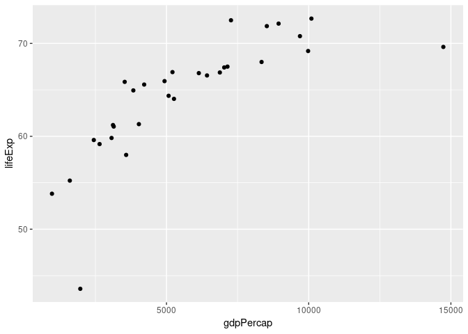

Gapminder Exercise Template
================
Michele Caprio
2018-08-20

## Load packages

    ## [1] 6

## Load data

more text..

## Exercises

### Exercise 1

How many observations are in this dataset?

There are 1704 obs in the dataset

### Exercise 2

Visualize the relationship between GDP and life expectancy for countries
in Europe in 1952 using a scatter plot.

<!-- -->

### Exercise 3

Add year 1967 in another color.

<!-- -->
